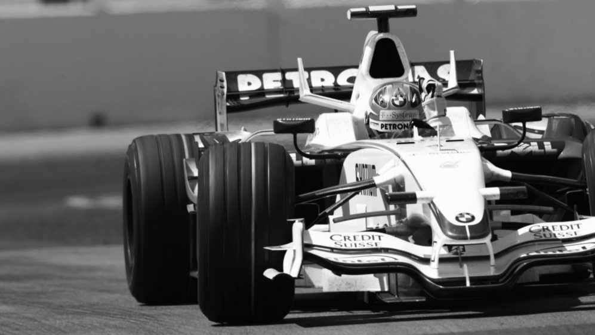
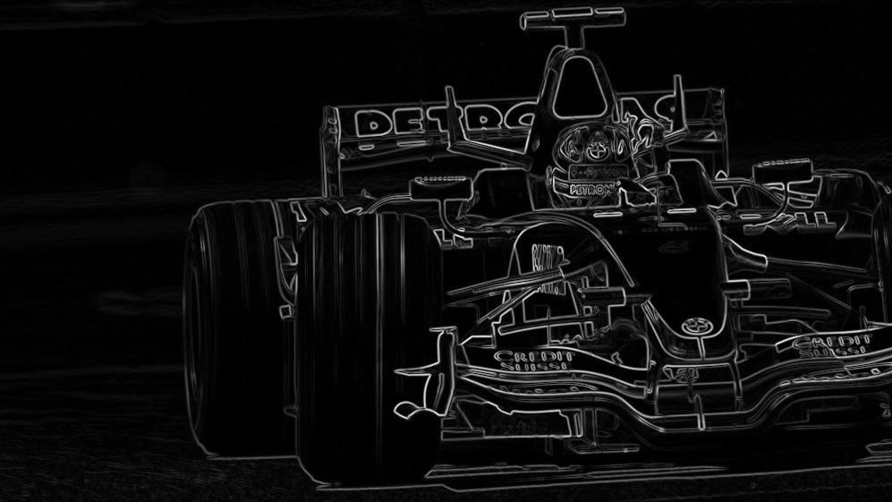
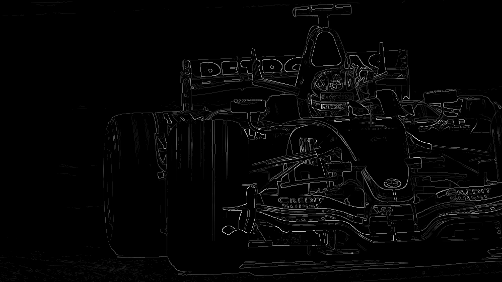
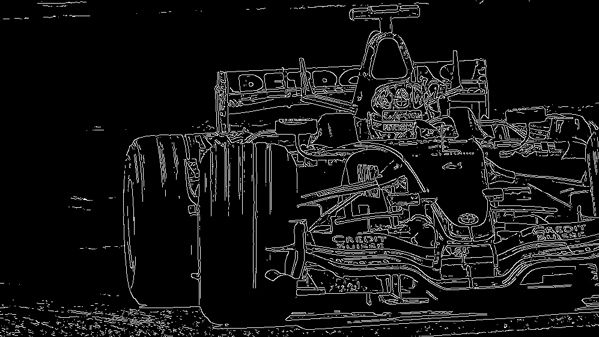

# Canny-edge-detector
Simple step-by-step implementation of the Canny edge detector.

## Steps
You can recover the image after each steps of the Canny edge detector. The steps are:

1. Turn to grayscale and smooth with a 5x5 Gaussian kernel and scale (parameter).
2. Calculate gradient per each pixel. 
3. Perform non-maximal supression on gradient norms.
4. Apply hysterisis-thresholding, with parameters threshold[0], threshold[1].

## Usage
To use the Canny edge detector simply type:
```{python}
img = CannyDetector(path       = path_to_image, 
					scale      = kernel_scale, 
					thresholds = [min_thr, max_thr]
)
```
And then you can recover all the intermediate steps by typing:
```{python}
img.img # Gets the original image in grayscale
img.simg # Gets the smoothed image
img.gradnorm # Gets the gradient norm
img.maxSup # Gets the output of non-maximal supression
img.edges # Gets the final output of Canny, the edges!
```

Some example of how each step looks on the image of Robert Kubica winning a Formula 1 Grand Prix in Canada 2008:

| Grayscale smoothed | Gradient norms |
| :-------------: |:-------------:| 
|         |  | 
| Non-maximal supression        | Final edges (thresholding)      | 
|    |       | 